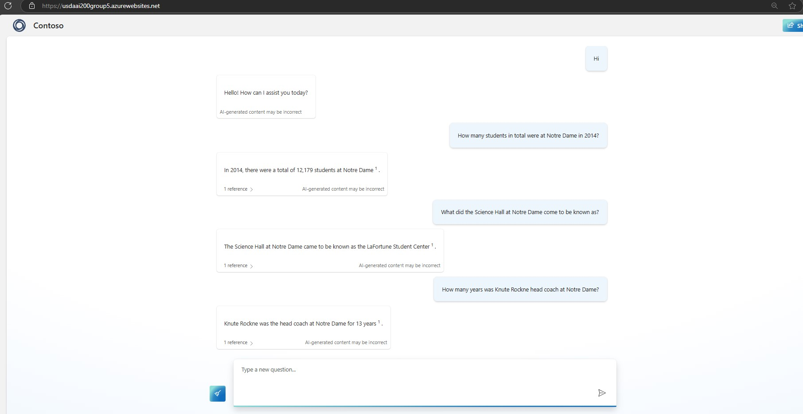

# AI Powered ChatBot AAI520 Group 5

This project implements two conversational chatbot using Retrieval-Augmented Generation (RAG)- Azure OpenAI services and second model with GPT Model and bot UI using github.io . The chatbot is designed to assist users in finding information, particularly for the Stanford University dataset.

## Bot Links:
RAG Bot - https://usdaai200group5.azurewebsites.net/

How to get access to the bot:
1. User need to added to the Azure Subscription. Please reach out to jgullinkala@sandiego.edu to get access to the bot. For the final review purposes, we have added professor to the Azure Subscription. They just need to follow step 2 and 3 to access the bot.
2. Once added to the Azure Subscription, You will receive an email from Azure with the subject "Default Directory invited you to access applications within their organization". Click on the Accept Invitation button in the email.
3. Once you accept the invitation, you will be able to access the bot using the link provided above.


## Project Structure

- `notebooks/`
  - `RAG_ChatBot_AII520_Group5.ipynb`: Main notebook implementing the RAG chatbot.
  - `GPT-2 Chatbot.ipynb`: Notebook for the GPT-2 Chatbot
- `standford_questioner_dataset/`
  - `dev-v1.1.json`: Development dataset.
  - `train-v1.1.json`: Training dataset.
- `README.md`: This file.

## Getting Started

### Prerequisites

- Python 3.x
- Jupyter Notebook
- Azure OpenAI API key

### Installation

1. Clone the repository:
    ```sh
    git clone <repository-url>
    cd <repository-directory>
    ```
### Usage

1. Open the Jupyter Notebook:
    ```sh
    jupyter notebook notebooks/RAG_ChatBot_AII520_Group5.ipynb
    ```

2. Run the notebook cells to initialize the chatbot and start interacting with it.

### Example

```python
# Get the response from the conversational chat bot
response = conversational_rag_bot(user_input)

# Print the response
print("Bot:", response)
```
### RAG Chat bot Conversations
| <h1 style="font-size:60px;">Rag bot Conversation</h1> |
|:-:|
|  |

